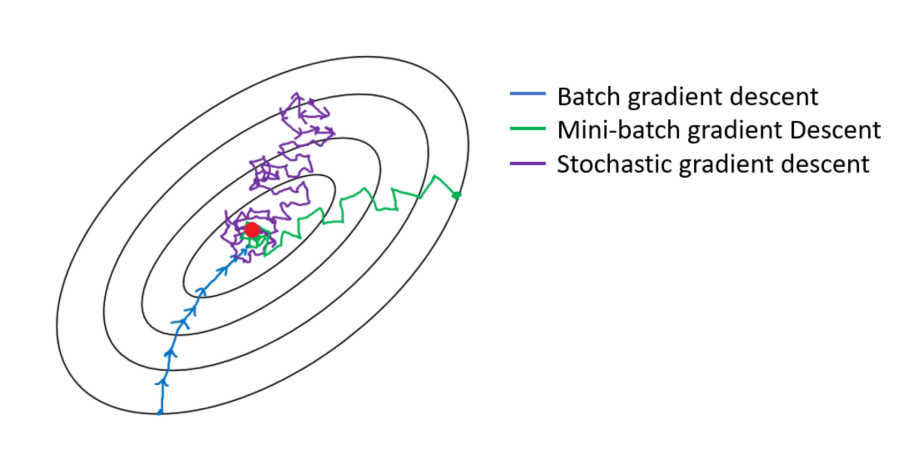
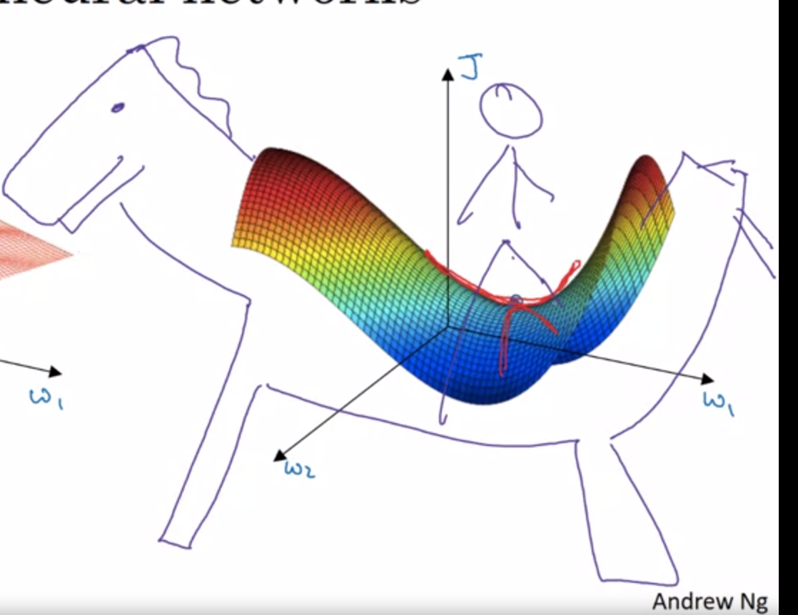
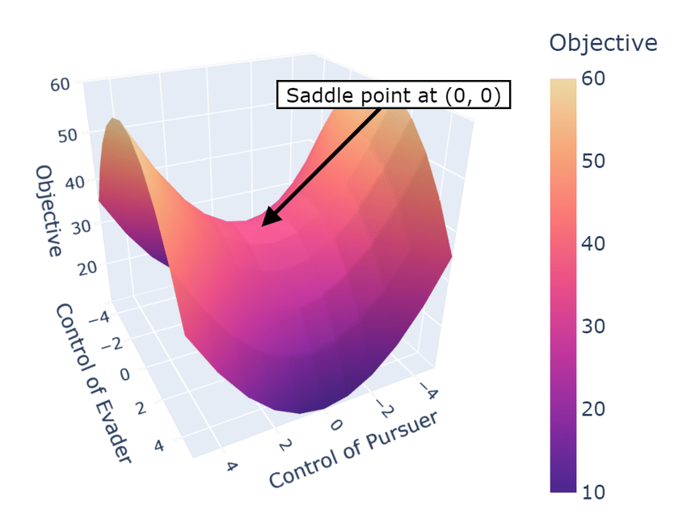
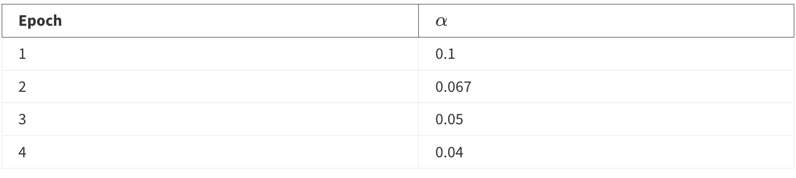

# Optimizers in Deep Learning 👑

Gradient descent algorithm is used to update the weights learned in machine learning & deep learning.

But, if you create a very sophisticated/deep model, it becomes very time consuming and resource taking to train models.

#### To speed up training, some initial measures taken were:

- Different ways of apply gradient descent (Batch, Mini-Batch, Stochastic)

- Batch Normalization (normalizing the input dataset)

- Activation functions also affect the performance to some extent.

---

### ~> To tackle this, different type of gradient descent algorithms were introduced:

    1. `Batch Gradient Descent`:
        - weights are updated only iteration over the whole dataset.
        - If we have 5 epochs, weights are updated 5 times.

    2. `Mini-Batch Gradient Descent`🤴🏻:
        - weights are updated after a certain number of data-points (let's say, 10)
        - If we have 5 epochs, 100 data-points & set batch size to be 10, weights are updated 50 times.

    3. `Stochastic Gradient Descent`:
        - weights are updated after each data-point in the dataset.
        - If we have 5 epochs & 100 data-points, weights are updated 500 times.

- Weights in batch gradient descent follow a smooth path, while it gets more zig-zag for the two (mini-batch & stochastic).

- **Mini-Batch is most preferred one.**

---

### Problems with `Batch Gradient Descent algorithms` 😈

- Batch gradient descent is a much slower learning process because we update weights only once in an epoch (whole dataset have been traversed).

- The entire training set can be too large to process in the memory.

- Batch gradient descent can get stuck in shallow local minima or **`saddle points`**, where the gradient is either very small or zero. Here, gradient becomes 0, so no update is done in weights or biases.

- **`Saddle point`**: A saddle point is a point on a graph of a function where the slopes (derivatives) in orthogonal directions are all zero. It's also known as a minimax point. 

---

## Challenge of `alpha (learning parameter)` in Gradient Descent 🤺

- **Suitable LR differs from dataset to dataset**.

- Smaller LR takes too long to reach minima

- Larger LR causes divergent behaviors

- **Another challenge is, if we have a 10-Dimensional space where we need to find the minima, we can't have 10 different `learning rate`, but we might be required to use different LR in different directions. In normal scenarios, we have to adjust with one LR only.**

---

## Learning Rate Decay 🤓

- Another technique to reduce time taken for model training is to use `Learning Rate Decay`.

$$ \alpha = \frac{1}{1 + decayRate * epochNumber} * \alpha $$

- For example, let's $\alpha = 0.2$ and decayRate = 1. Then:

- But, **learning rate decay** is typically not even considered when optimizing model training. But, this is something to know about.

---

## Let's tackle the challenge 🧑🏻‍💻

- To tackle these issues, different optimizers where introduced. Some of them are:
    - SGD with momentum
    - Nesterov Accelerated Gradient (NAG)
    - AdaGrad
    - RMSProp
    - Adam Optimizers

- But, to understand them, first we need to know about **`Exponentially weighted moving average (EWAM)`**.
