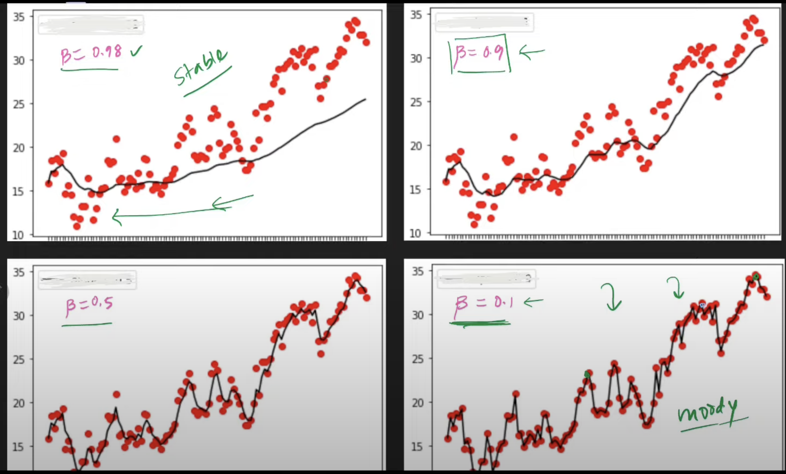
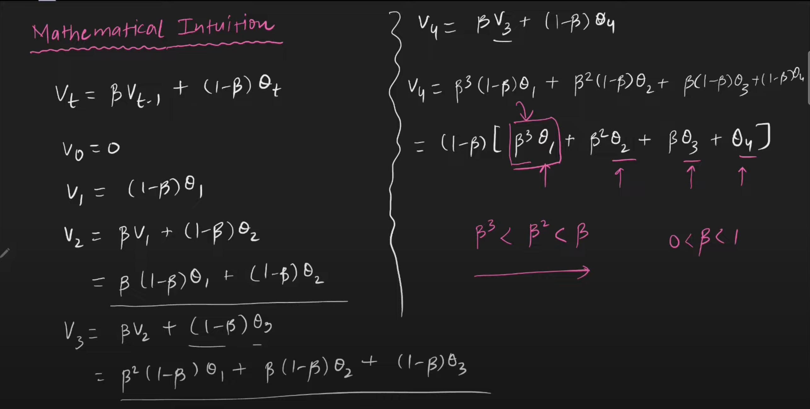

# Exponentially Weighted Moving Average (EWMA) 💹

## Overview

`EWMA is a statistical method used to analyze and smooth out time series data to identify trends over a certain period while giving more weight to recent observations.`

- **`It assigns exponentially decreasing weights as observations get older, with the most recent observations carrying more significance.`**

## Formula

The formula for calculating EWMA is:

\[ S_t = \alpha \times Y_t + (1 - \alpha) \times S_{t-1} \]

Some replace $(1 - \alpha)$ with $(\beta)$.
\[ S_t = (1 - \beta) \times Y_t + \beta \times S_{t-1} \]

Where:
- \( S_t \) = EWMA at time 't'
- \( Y_t \) = Observation at time 't'
- \( \alpha \) = Smoothing factor (0 < \( \alpha \) ≤ 1)

The smoothing factor \( \alpha \) determines the rate of decay of the older observations' influence on the average.

- **A smaller \( \alpha \) assigns more weight to older observations, whereas a larger \( \alpha \) gives more weight to recent data**.

- **A larger \( \beta \) assigns more weight to older observations, whereas a smaller \( \beta \) gives more weight to recent data**.

---

### Example:

>
> let data = [1, 2, 3]
> alpha = 0.5
> so, ewma_data = [1, 1.5, 2.25] 

---

### Intuition of \( \beta \) 😈

For intuition of beta, you can think of it as an average of last X days.

$$ previous (X) = 1 / (1 - \beta) $$

- If \( \beta \) is 0.9, means, current days value depends on last 10 days values.



- \(\beta\) = 0.98, means takes average of last 50 days. Someone's todays happiness depends on experiences of last 50 days, means very stable emotions. Neither too happy nor too sad.

- \(\beta\) = 0.1, means takes average of last 1 day. Someone's todays happiness depends on experiences of yesterday or today only, means very moody. Sometimes, too happy sometimes too sad.

- **Generally, \(\beta\) = 0.9 is taken as default.**

---

### But, how can we say if today's EWMA depends on previous EWMA?



---

## Properties

- **Adaptability**: EWMA adapts quickly to changes in data patterns due to the higher emphasis on recent observations.
- **Constant Memory**: It requires storing only the previous EWMA value and the current observation.
- **Parameter Selection**: The choice of \( \alpha \) affects the responsiveness of the EWMA to changes in the data.

## Usage

EWMA finds applications in:
- **Finance**: Predicting trends in stock prices, volatility analysis.
- **Quality Control**: Monitoring production processes by smoothing out variations.
- **Signal Processing**: Noise reduction in signal data.

- **Deep learning optimizers**

## Implementation in python 🐍

### Python Example

```python
import pandas as pd

# Creating a dummy dataset
data = [1, 2, 3]

# Creating a DataFrame
df = pd.DataFrame(data, columns=["Values"])

# Calculating EWMA with alpha = 0.5
ALPHA = 0.5
ewma = df.ewm(alpha=ALPHA, adjust=False).mean()
# to know about (adjust=False), 
# visit here: https://pandas.pydata.org/docs/reference/api/pandas.DataFrame.ewm.html


my_ewma = [0.0 for _ in range(len(data))]

for i, curr_data in enumerate(data):
    if i == 0:
        my_ewma[i] = curr_data
    else:
        my_ewma[i] = ((1 - ALPHA) * my_ewma[i - 1]) + ((ALPHA) * curr_data)

print(data)
print(ewma)
print(my_ewma)

```
