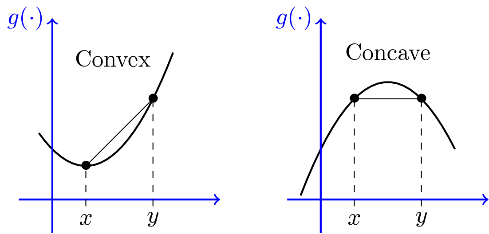

# SGD with Momentum 🏃🏻🤺

To understand SGD, we first we need to have good understanding of couple of things:

### Convex v/s Non-convex functions: 👩🏼‍✈️

- a real-valued function is called convex if, the line segment between any two distinct points on the graph of the function lies above the graph between the two points. 

---

## Why Momentum? 🏃🏻

- Simple gradient descent algorithms get stuck in local minima, or take too long to cross `saddle point` (because of very low gradient), or have a time crossing a high curvature.

- Gradient Descent with momentum can overcome these challenges.

---

### Intuition:

- Suppose you're travelling to your village. But, you don't know the direction. You ask people during your journey for the direction. You asked first person, he told you to go right, after sometime, you asked second person, he again told you to keep going right, similarly third and fourth person told you to go right. So, should you keep driving at the same speed or speed up in the right direction. This is what momentum is all about.

- Pink ball (SGD with momentum); Blue ball (Normal SGD)

- SGD with momentum crosses local minima and eventually reaches global minima, while normal SGD can't

- Speed of SGD with momentum > speed of normal SGD

#### Note 🚫

- `SGD with momentum` **keeps oscillating** in the minima for a couple of times before reaching global minima. This is a serious **`downside`** of minima.

---

## Mathematically:

- We add the gradient with the EWMA (exponentially weighted moving average) of previous gradients.

- Typically, we take $\beta = 0.9$ for EWMA.

- $\beta$ is called, **Decaying factor**.

- If $\beta = 0$, it's **normal SGD**.

- If $\beta = 1$, **there will be no decay**. It will keep oscillating. 

---

### SGD with momentum converging to minima with less noises: 🤫

---