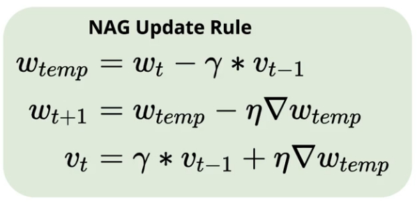
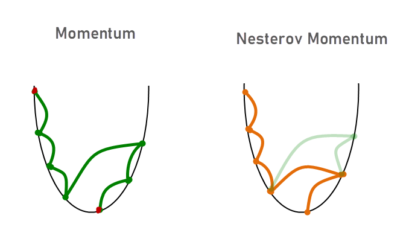

# Nesterov Accelerated Gradient (NAG) 🐍

- An optimization over `SGD with momentum`, and performs better than it.

- It is very similar to `SGD with momentum`, except, **in momentum, we updates weight with (momentum + gradient at the same point). But, in `NAG (Nesterov Accelerated Gradient) algorithm`, we update weight with (momentum + gradient at the new point where we will reach after applying momentum)**.

- NAG dampens momentum.

- The new point we reach after applying momentum is called, `look ahead point`.

-  **`Nesterov momentum first makes a big jump in the direction of the previous accumulated gradient and then measures the gradient where it ends up and makes a correction. The idea being that it is better to correct a mistake after you have made it.`**

---

## Maths Behind NAG 😎

1. We first calculate temp_position (where we will reach if only momentum is applied).

2. Then, we find gradient at the point and subtract temp_position with (gradient * learning_rate).

3. Velocity is then calculate based on sum of (gradient_descent at the temp position) and ($\beta$ * previous_momentum).

---

## Disadvantage of NAG 🚫

- **This Dampening factor can cause the SGD to get stuck in local minima.**

---

## Simple intuition: 🧐

- Think of it as, you predetermine what will happen next, and then take action based on that.

- Fixing the error that your current move is going to do.