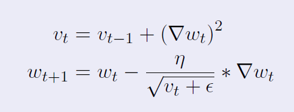

# AdaGrad (Adaptive Gradient Algorithm) 😎

- **`AdaGrad is a brilliant algorithm if some columns in your data are sparse (most data-points are zero)`**.

- **Gradient in such cases remain very small and takes too long to reach minima via SGD, or SGD with Momentum, or NAG**.

- AdaGrad is very fast in such scenarios. 😎

---

## Overview

AdaGrad is an optimization algorithm designed for adapting the learning rate to the parameters in machine learning models.

- **`It adjusts the learning rate based on the historical gradients of the parameters, giving larger updates to infrequent parameters and smaller updates to frequent ones`**.

---

## Algorithm

AdaGrad maintains a per-parameter learning rate that is inversely proportional to the square root of the sum of squared gradients up to the current time step.

Where:

- $\( V_{t} \)$ = Sum of squares of past gradients
- $\( \eta \)$ = Learning rate
- $\( \epsilon \)$ = Small constant (to prevent division by zero)

## Properties

- **Adaptive Learning Rate**: AdaGrad adapts the learning rate individually for each parameter.
- **Sparse Data Handling**: It performs well with sparse data by giving smaller updates to frequently occurring features.
- **Automatic Scaling**: It automatically scales the learning rates based on the past gradients, which can alleviate the need for manual tuning of the learning rate.

## Usage

**AdaGrad is commonly used in training neural networks and other machine learning models, especially when dealing with sparse data or models with varying gradients across parameters.**

---

## Disadvantages 🚫

- It never reaches