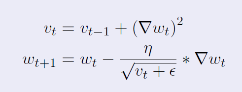

# RMSProp (Root Mean Square Propagation) 🤓

- An improvement over AdaGrad.

### So, what was the problem with AdaGrad?

> (Sum of previous gradients) keeps increasing, leading to almost zero learning rate. Hence, no updates in weights.
>
> Alright then, call the EWMA (Expected Weighted Moving Average). 📞☎️
>
> We will apply EWMA over the (sum of previous gradients). 😎

- $g_t^2$ is the gradient square.

---

### Compare RMSProp with AdaGrad: 💃🏼

- AdaGrad formula:

- If we apply EWMA, we get RMSProp (root mean square propagation).

---

## Disadvantages 🚫

- There's no as such disadvantage of RMSProp. Before **`ADAM`** algorithms, RMSProp was widely used. 

- `If you don't get good performance from ADAM, RMSProp can be used.`