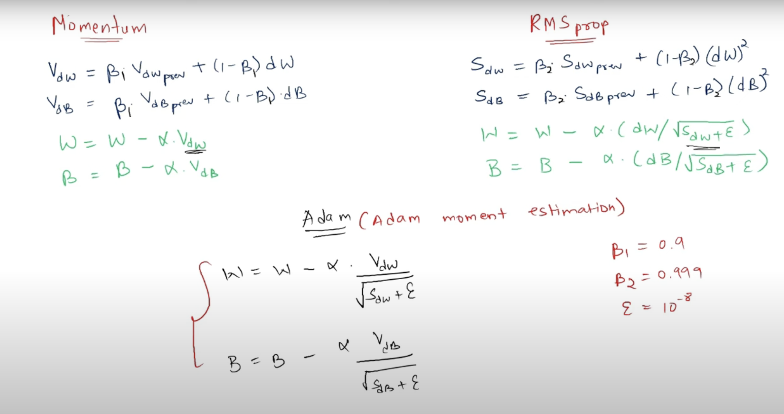

# ADAM (Adaptive Moment Estimation) 🦸🏻

- So, We now have knowledge regarding two ideas in optimizers:
  - Momentum (better speed) 🏃🏻
  - Adaptive Gradient (For handling Sparse dataset) 💃🏼

- **Why not combine the two thoughts to create a new optimizer?** 😎

---

## ADAM formula 😈

- We have basically combined `momentum` & `RMSProp`.

- We also need to perform `bias correction` because of the error introduced at `t=0` due to taking $V_{dw}$ = 0 at start and same for $S_{dw}$.

- Hence, actual formula:
  
$$ m_t (momentum) = \beta_1 * m_{t-1} + (1 - \beta_1) * \Delta w_t $$

$$ v_t (adaptive) = \beta_2 * v_{t-1} + (1 - \beta_2) * (\Delta w_t)^2 $$

- Now, we will perform `bias correction` to fix the issue introduced at `t=0` because of our assumption.

$$ \hat{m_t} = \frac{m_t} {1 - \beta_1^t}  $$

$$ \hat{v_t} = \frac{v_t} {1 - \beta_2^t} $$

- `t` is the epoch number **(we are raising power of Beta by the epoch number**).

#### Note 🚫: If you don't understand, see the last topic of [EWMA](./02_Exponentially_Weighted_Moving_Average.md)

- And, the final formula is:

$$ w_{t+1} = w_t - \frac{\eta}{\sqrt{\hat{v_t} + \epsilon}} * \hat{m_t} $$

---

## ADAM ✅ works best in most of the scenarios.
